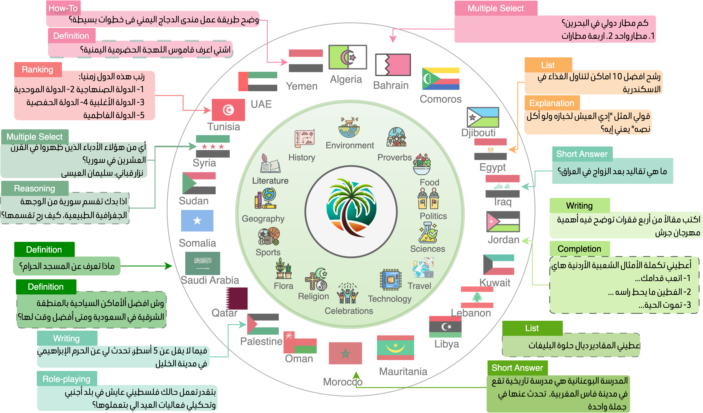

# Palm: Evaluating LLMs on a Culturally Inclusive and Linguistically Diverse Arabic Dataset
<p align="center">
  
</p>

[](https://opensource.org/licenses/MIT)
[](https://www.python.org/downloads/)
[](guidelines.md)
[](examples.md)

This repository contains evaluation tools for the *Palm* dataset — a **C**ulturally **I**nclusive and **L**inguistically **D**iverse dataset for Arabic LLMs.

## 🌟 Overview
The Palm dataset provides a comprehensive benchmark for evaluating the performance of Large Language Models on Arabic language tasks across diverse dialects and cultural contexts. This repository focuses on the evaluation pipeline using the test set portion of the Palm dataset.

## 🛠️ Requirements
- Python 3.8+
- PyTorch
- vLLM
- 4x A100 GPUs (as used in our experiments)

Install required packages:
```bash
pip install -r requirements.txt
```

## 📋 Evaluation Pipeline
Our evaluation pipeline consists of two main steps:
1. **Generate responses** using your LLM
2. **Judge the quality** of responses using LLM-as-Judge method

### Step 0: Serve the LLM
Before running either of the main scripts, you need to serve your LLM using vLLM:
```bash
./serve_llm.sh "llm_path" num_gpus port
```
Where:
- `llm_path`: Name or path of the LLM to serve (local path or HuggingFace model ID)
- `num_gpus`: Number of GPUs to use
- `port`: Port where vLLM will be served

Example:
```bash
./serve_llm.sh "models/Qwen2.5-7B-Instruct" 4 8000
```

### Step 1: Generate Responses
Use the `gen_responses.py` script to generate responses for the instructions in the test set:
```bash
python gen_responses.py \
  --model_path models/Qwen2.5-7B-Instruct \
  --vllm_model_id models/Qwen2.5-7B-Instruct \
  --data_path data/test.jsonl \
  --max_length 4096 \
  --vllm_port 8000
```
Parameters:
- `model_path`: Local path or HuggingFace model ID
- `vllm_model_id`: ID provided by vLLM when the model is served
- `data_path`: Path to the test data file
- `max_length`: Maximum sequence length for generation
- `vllm_port`: Server port of vLLM

The generated responses will be saved to `responses/{model_id}.jsonl`.

### Step 2: Judge Responses
Next, serve your Judge LLM using the same `serve_llm.sh` script, then evaluate the generated responses:
```bash
python judge.py \
  --output_judgements Qwen2.5-7B-Instruct \
  --vllm_model_id models/Qwen2.5-72B-Instruct \
  --preds_file responses/Qwen2.5-7B-Instruct.jsonl \
  --max_length 2048 \
  --vllm_port 8000
```
Parameters:
- `output_judgements`: Filename where judgments will be logged (without extension)
- `vllm_model_id`: ID assigned by vLLM for the judge model
- `preds_file`: File containing the generated responses from Step 1
- `max_length`: Maximum sequence length for judgment generation
- `vllm_port`: Server port of vLLM for the judge model

The judgments will be saved to `judgements/{output_judgements}.jsonl`.

## 📊 Example Workflow
```bash
# 1. Serve the response-generating LLM
./serve_llm.sh "models/Qwen2.5-7B-Instruct" 4 8000

# 2. Generate responses
python gen_responses.py \
  --model_path models/Qwen2.5-7B-Instruct \
  --vllm_model_id models/Qwen2.5-7B-Instruct \
  --data_path data/test.jsonl \
  --max_length 4096 \
  --vllm_port 8000

# 3. Stop the first LLM server and serve the judge LLM
./serve_llm.sh "models/Qwen2.5-72B-Instruct" 4 8000

# 4. Judge the responses
python judge.py \
  --output_judgements Qwen2.5-7B-Instruct \
  --vllm_model_id models/Qwen2.5-72B-Instruct \
  --preds_file responses/Qwen2.5-7B-Instruct.jsonl \
  --max_length 2048 \
  --vllm_port 8000
```

## 📝 Citation
If you use this dataset or code in your research, please cite:
```bibtex
```

## 📄 License
This project is licensed under the MIT License.

## 🤝 Contact
For questions or feedback, please open an issue on this repository.
